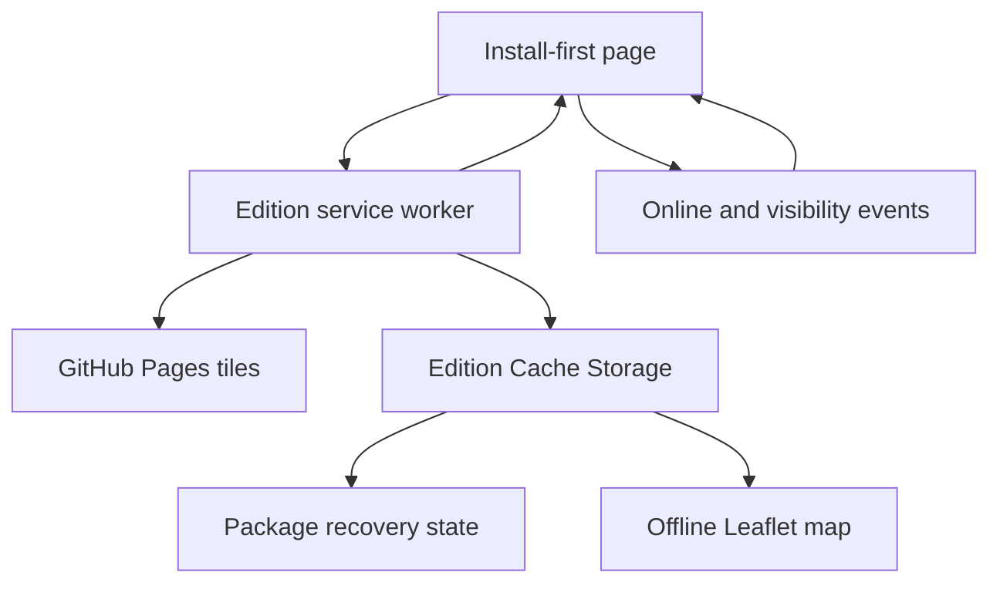

# fix: Make offline imagery downloads finish unattended

## Summary

Replace stop-on-chunk-failure behavior in both Rio das Mortes editions with a persistent failed-tile queue, bounded automatic retries, adaptive concurrency, and outage-aware recovery. Preserve all 34,994 tiles, the install-first full-screen experience, and exact offline-package verification.

---

## Problem Frame

The current service workers download 20 files concurrently in 200-tile chunks. Any failed request makes the chunk incomplete and stops the process, so a package containing 34,994 individual requests can demand repeated manual retries even though successful tiles remain cached. The goal is to make completion effectively unattended on an imperfect connection without weakening the definition of a complete offline map.

---

## Requirements

- R1. Preserve the complete 34,994-tile manifest, including zoom-17 coverage of the river and all five roads, in both editions.
- R2. Continue the primary download after individual tile failures instead of stopping the entire chunk.
- R3. Persist the cursor, deduplicated failed-tile queue, attempt history, retry timing, package identity, and recovery phase so reopening the app resumes safely.
- R4. Retry transient failures automatically with bounded exponential backoff, jitter, `Retry-After` support, and adaptive request concurrency.
- R5. Prevent a full outage from consuming every tile's retry budget by pausing normal work behind a circuit breaker and using bounded connectivity probes.
- R6. Keep manual retry hidden while automatic recovery is active; expose it only after recovery is exhausted or a blocking condition requires user action.
- R7. Count unique cached tiles rather than attempts, keep progress monotonic, and reveal the map only after exact manifest-to-cache verification succeeds.
- R8. Preserve independent INPE and Google caches, state, service-worker scopes, messages, and installed identities.
- R9. Work in Android Chrome/Brave and iOS Safari/Home Screen without relying on Background Sync or on a service worker remaining alive indefinitely.
- R10. Preserve already cached tiles and partial progress when this downloader-only release replaces the current worker.

---

## Scope Boundaries

- Do not reduce resolution, geographic coverage, or the 34,994-image count.
- Do not bundle tiles into archives, PMTiles, or another packaging format.
- Do not replace the PWA with a native application.
- Do not change route data, POIs, GPS behavior, notes, imagery pixels, or the established map interface.
- Do not modify `build-inpe-tiles.py` or `download-google-tiles.py`; their build-time retry and manifest-integrity behavior is separate from device installation.

### Deferred to Follow-Up Work

- Split versioned app-shell caches from package-ID-scoped imagery caches. The trial release will preserve the existing imagery caches and migrate their progress metadata in place so current downloads are not discarded.
- Repackage many tile files into larger downloadable units only if the unattended queue still proves unreliable in physical-device acceptance.

---

## Context & Research

### Relevant Code and Patterns

- `sw.js` and `google/sw.js` already bound work to 200-tile service-worker events, persist a cursor, enforce a 15-second request timeout, retain prior complete caches during upgrades, and verify exact manifest membership before readiness.
- `app.js` already owns the full-screen install-first state, storage preflight, progress display, service-worker activation gate, and manual recovery action.
- `tests/offline-worker.test.mjs` and `tests/google-offline-worker.test.mjs` provide VM-based service-worker and Cache API harnesses for deterministic interruption, cache replacement, and exact-completion tests.
- `tests/install-first-flow.test.mjs` protects the no-map landing and download-screen gating behavior.
- The Pindaíba and Carinhanha apps establish the static vanilla JavaScript, Leaflet, GitHub Pages, Service Worker, and Cache API architecture; this plan strengthens that pattern rather than replacing it.
- Tile distribution is identical in both editions: 26 at zoom 10, 77 at 11, 233 at 12, 576 at 13, 815 at 14, 2,616 at 15, 6,629 at 16, and 24,022 at 17.

### Institutional Learnings

- Package readiness must continue to require exact agreement among the plan, manifest, tile files, package count/bytes, and current-cache membership. A cached-item count alone is insufficient.
- Bounded service-worker events, durable checkpoints, storage preflight, prior-cache preservation, and actual airplane-mode device validation are established release constraints.
- There is no repository-local `docs/solutions/` corpus. The relevant prior knowledge is the Pindaíba/Carinhanha implementation lineage and the existing worker tests.

### External References

- [MDN: `ExtendableEvent.waitUntil()`](https://developer.mozilla.org/en-US/docs/Web/API/ExtendableEvent/waitUntil) confirms that a worker event stays alive only while its registered promise remains unsettled; recovery waits should therefore be coordinated by the active page rather than a long-lived worker timer.
- [MDN: Background Synchronization API](https://developer.mozilla.org/en-US/docs/Web/API/Background_Synchronization_API) marks Background Sync as limited availability, so it cannot be the cross-browser foundation.
- [WebKit storage policy](https://webkit.org/blog/14403/updates-to-storage-policy/) documents quota failures, eviction, storage estimation, and persistent-storage heuristics relevant to the 199.9 MB and 547.3 MB packages.
- [Chrome Workbox retry guidance](https://developer.chrome.com/docs/workbox/retrying-requests-when-back-online) supports persisting failed requests and retrying them when connectivity returns, while also noting that non-network HTTP failures require explicit classification.
- [web.dev: Storage for the web](https://web.dev/articles/storage-for-the-web) recommends Cache Storage for network resources and explicit persistent-storage handling for large offline data.

---

## Key Technical Decisions

| Decision | Chosen behavior | Rationale |
|---|---|---|
| Failure handling | Persist failures as package-scoped queue entries and continue untouched work | A failed image becomes recoverable state instead of a stop signal |
| Retry budget | Four automatic attempts per tile including the initial request; manual retry resets only unresolved entries | Bounded recovery avoids infinite loops while normally eliminating clicks |
| Retry classification | Automatically retry network errors, timeouts, 408, 429, and 5xx; honor `Retry-After`; retry 404/410 twice before terminal classification | Separates transient delivery failures from likely package defects |
| Backoff | Capped exponential delay with jitter; persisted due times survive reloads | Prevents synchronized request bursts and repeated immediate failures |
| Adaptive concurrency | Start at 6, range from 2 to 12, halve on timeout/429 or at least 10% retryable failures, add 1 after three clean windows | The current concurrency of 20 is aggressive for thousands of mobile requests |
| Queue fairness | Give due retries a bounded share of each work unit while continuing new manifest entries; drain the queue fully after the primary cursor ends | A persistently bad tile cannot starve the remaining package |
| Global outage | Open a circuit after two highly failed windows, stop normal attempts, and use three bounded probes; resume immediately on online/foreground events | Unattempted tiles must not lose retry budget during an outage |
| Worker lifecycle | Keep each worker event bounded; the visible page schedules the next due unit and rechecks on visibility/connectivity changes | Works without unsupported Background Sync and survives worker termination |
| Multiple clients | Coalesce duplicate requests for the same package/run; only an explicit manual force-retry may cancel active work | Prevents browser and installed-app clients from aborting one another |
| Storage errors | Treat quota/cache-write failures as blocking, not network-retryable | Retrying cannot create storage space and would waste bandwidth |
| Completion | Write the ready marker only after exact URL verification; repair any eviction found before or behind the cursor | Preserves the existing release invariant |
| Rollout continuity | Migrate the current cursor-only state to the new schema and retain current edition caches for this downloader-only update | Users testing the fix should not restart a partially completed package |

Concurrency is session-local and restarts conservatively at 6. Tile attempts and queue state persist across sessions. A genuine offline-to-online transition grants one fresh automatic recovery cycle even after prior exhaustion; otherwise the manual action is required.

---

## Open Questions

### Resolved During Planning

- Should coverage be reduced? No; all 34,994 tiles remain required.
- Should failures block the primary sweep? No; they enter a durable queue while new work continues.
- Should Background Sync drive recovery? No; limited Safari support makes it an optional enhancement at best, not a dependency.
- When should manual retry appear? Only after bounded automatic recovery is exhausted or storage/package integrity is blocking progress.
- Should the two editions share one runtime queue? No; their caches and worker scopes remain isolated, with parity enforced through tests.

### Deferred to Implementation

- Exact human-readable Portuguese copy for downloading, waiting, repairing, storage-blocked, and exhausted phases may be refined during mobile visual QA without changing the state contract.
- The backoff cap and probe intervals may be tuned within the documented bounded policy if deterministic fault simulations expose unnecessary delay or server pressure.

---

## High-Level Technical Design

> *This illustrates the intended approach and is directional guidance for review, not implementation specification. The implementing agent should treat it as context, not code to reproduce.*

```mermaid
stateDiagram-v2
    [*] --> Checking
    Checking --> PrimaryDownload
    Checking --> StorageBlocked
    PrimaryDownload --> PrimaryDownload: successful bounded work
    PrimaryDownload --> PrimaryDownload: queue retryable failure; cursor continues
    PrimaryDownload --> Verifying: primary cursor complete
    PrimaryDownload --> RecoveryWaiting: primary cursor complete; retries pending
    RecoveryWaiting --> RecoveryDownload: due time, online, or foreground
    RecoveryDownload --> RecoveryWaiting: queue remains within budget
    RecoveryDownload --> Verifying: queue empty
    RecoveryDownload --> Exhausted: budget exhausted
    Verifying --> Ready: exact 34,994 URLs present
    Verifying --> RecoveryWaiting: missing tiles found
    StorageBlocked --> Checking: space freed and user retries
    Exhausted --> RecoveryDownload: manual retry of unresolved work
    Ready --> [*]
```

The persisted state belongs to the current imagery package and contains a schema version, package identity, manifest count, primary cursor, phase, and deduplicated failed entries with attempt and due-time metadata. The worker persists state before yielding; the page renders and schedules from worker-reported state. Progress is the number of unique required URLs confirmed in the current cache, never the number of network attempts.

---

## Implementation Units

- U1. **Define and persist the package recovery state**

**Goal:** Replace the cursor-only checkpoint with a versioned, package-scoped state that can preserve unresolved tiles and safely survive reloads, worker replacement, malformed metadata, and package changes.

**Requirements:** R2, R3, R7, R8, R10

**Dependencies:** None

**Files:**
- Modify: `sw.js`
- Modify: `google/sw.js`
- Test: `tests/offline-worker.test.mjs`
- Test: `tests/google-offline-worker.test.mjs`

**Approach:**
- Keep the workers self-contained because their scopes, cache prefixes, and tile-path predicates differ; enforce behavioral parity through mirrored contract tests.
- Persist cursor and failed entries together at every completed batch and before yielding for a delayed retry.
- Deduplicate failures by manifest identity, increment attempts without inflating progress, and remove recovered entries independently.
- Migrate valid cursor-only progress for the unchanged package ID. Ignore or clean metadata with a different package ID or unsupported schema without deleting a previous complete package.
- Preserve the existing exact final verification and stale-marker repair behavior.

**Execution note:** Add characterization and migration tests before replacing the cursor-only format.

**Patterns to follow:**
- Package-scoped marker and progress responses already stored by `sw.js` and `google/sw.js`.
- Exact cache membership and eviction-repair coverage in the existing worker tests.

**Test scenarios:**
- Happy path: a clean small manifest advances the cursor, stores no failures, verifies exact membership, and becomes ready.
- Interruption: several tiles fail, the worker yields, a new worker instance reads the same cursor and queue, and resumes without refetching confirmed tiles.
- Deduplication: repeated failure of one URL produces one queue entry with an incremented attempt count.
- Recovery cleanup: one queued tile succeeds while another remains failed; only the recovered entry is removed.
- Corrupt state: malformed JSON, wrong schema, invalid cursor, duplicate entries, and a mismatched package ID are rejected or rebuilt safely.
- Upgrade: existing cursor-only state for the unchanged package migrates without deleting cached imagery.
- Isolation: root and Google state, ready markers, and cache cleanup never cross scopes.
- Eviction: removing a tile behind the cursor causes final verification to queue and repair it rather than falsely completing.

**Verification:**
- A new worker instance can reconstruct all remaining work from persisted state, and no state corruption can produce a false ready marker or remove the other edition.

---

- U2. **Implement unattended adaptive recovery**

**Goal:** Continue past individual failures, retry them automatically under a deterministic policy, adjust concurrency to connection quality, and stop wasteful work during a global outage.

**Requirements:** R2, R4, R5, R6, R7, R9

**Dependencies:** U1

**Files:**
- Modify: `sw.js`
- Modify: `google/sw.js`
- Test: `tests/offline-worker.test.mjs`
- Test: `tests/google-offline-worker.test.mjs`

**Approach:**
- Replace fixed 20-wide batches with bounded worker pools governed by the adaptive policy in Key Technical Decisions.
- Classify response, timeout, network, cache-write, quota, and abort outcomes before changing retry state.
- Continue new manifest work while giving due retries a bounded share, then drain unresolved work after the primary cursor completes.
- Persist retry due times and honor server-provided delays. Do not charge unattempted work while the circuit is open.
- Keep service-worker events bounded and report whether the next transition is immediate work, scheduled recovery, exhausted recovery, storage blocking, verification, or readiness.
- Coalesce duplicate start requests. Preserve explicit force-retry cancellation without allowing normal multi-client messages to abort an active run.

**Execution note:** Implement the scheduler test-first with deterministic clocks, controlled fetch outcomes, and measured in-flight concurrency.

**Patterns to follow:**
- Existing timeout/abort handling and `event.waitUntil()` bounded precache runs.
- Build-time downloaders' bounded retry posture, without coupling build scripts to browser runtime.

**Test scenarios:**
- Transient recovery: 5% of tiles fail twice with retryable outcomes; other tiles continue and all failures recover without a manual action.
- Permanent failure: one tile always fails; the other manifest entries finish, the tile reaches exactly its budget, no ready marker is written, and the unresolved queue remains.
- Adaptive decrease: timeout, 429, and a window at or above the failure threshold reduce measured concurrency without dropping below 2.
- Adaptive recovery: three clean windows raise concurrency one step at a time without exceeding 12.
- Retry timing: a 429 with `Retry-After` is not requested before its persisted due time; ordinary retries use capped exponential delay with jitter.
- Fairness: a repeatedly failing due tile does not prevent untouched manifest entries from progressing.
- Global outage: after two highly failed windows, normal work stops, unattempted tiles retain zero attempts, and only bounded probes occur.
- Reconnection: an online or foreground transition resumes automatically and grants the documented recovery cycle without duplicating work.
- Quota failure: a cache write raises `QuotaExceededError`; network attempts stop, existing cached data remains, and a storage-blocked result is emitted.
- Multiple clients: browser and installed-app clients request progress simultaneously; one run owns the package and duplicate messages neither abort nor duplicate downloads.
- Manual recovery: after exhaustion, force retry resets only unresolved budgets and succeeds once the missing resource becomes available.

**Verification:**
- Deterministic harnesses demonstrate forward progress through scattered failures, bounded server pressure, no retry storms, and no manual action before a terminal or blocking state.

---

- U3. **Coordinate automatic recovery in the install-first UI**

**Goal:** Keep the user informed while the active page schedules bounded recovery work, without revealing the map or presenting unnecessary retry buttons.

**Requirements:** R3, R5, R6, R7, R8, R9

**Dependencies:** U1, U2

**Files:**
- Modify: `app.js`
- Test: `tests/install-first-flow.test.mjs`

**Approach:**
- Replace the generic eight-second manual-retry trigger with phase-aware status handling.
- Schedule the next bounded worker invocation from persisted worker state; re-evaluate on online and visibility changes instead of assuming page timers or the worker remain alive.
- Distinguish primary download, automatic retry countdown, repair, verification, storage blocked, exhausted, and ready states.
- Keep the displayed count monotonic and based on unique cached tiles. A displayed 100% during verification is not readiness.
- Show manual retry only for exhausted or actionable blocking states, and ensure one user action cannot create duplicate recovery timers.
- Preserve the current full-screen overlay and only hide it after genuine completion.

**Patterns to follow:**
- Existing service-worker controller-change gate, storage preflight, progress bar, and install-first overlay in `app.js`.
- Existing no-map and completion-gating assertions in `tests/install-first-flow.test.mjs`.

**Test scenarios:**
- Happy path: progress advances to exact readiness, the overlay stays full-screen through verification, and the map appears only afterward.
- Automatic retry: scattered worker failures produce retry status/countdown and continued progress without displaying the manual action.
- Slow connection: eight seconds without a progress event shows a non-actionable waiting state rather than a premature retry button.
- Exhaustion: the UI shows the exact unresolved count and one manual action only after the worker reports exhausted recovery.
- Storage blocked: the UI explains insufficient space, preserves progress, and offers retry only after the user can act.
- Background/foreground: suspended timers do not lose state; returning to the foreground requests current state and resumes due work once.
- Connectivity: going offline does not count unattempted tiles; coming online resumes once without duplicate timers.
- Multiple clients: all clients can display broadcasts, but ordinary progress messages do not start competing runs.
- Completion gate: no incomplete, waiting, verifying, blocked, or exhausted state invokes map reveal.

**Verification:**
- Android- and iPhone-sized browser automation shows an uninterrupted full-screen workflow in which transient failures recover without clicks and only exact readiness reveals the map.

---

- U4. **Protect rollout continuity and release evidence**

**Goal:** Ship the new downloader without discarding current partial caches, enforce parity in CI, document operational behavior, and complete live/device acceptance.

**Requirements:** R1, R7, R8, R9, R10

**Dependencies:** U1, U2, U3

**Files:**
- Modify: `validate-release.py`
- Modify: `.github/workflows/deploy.yml` if additional test entry points are introduced
- Modify: `README.md`
- Modify: `BUILD_SPEC.md`
- Test: `tests/offline-worker.test.mjs`
- Test: `tests/google-offline-worker.test.mjs`
- Test: `tests/install-first-flow.test.mjs`

**Approach:**
- Preserve the current imagery caches and unchanged package IDs during this downloader-only release; update the app shell without forcing completed or partial tiles to redownload.
- Add release-level assertions for state/message parity only where unit tests cannot protect the production artifact shape.
- Retain the exact 34,994-file, bytes, JPEG, zoom-17 coverage, and manifest validation for both packages.
- Document automatic recovery, when manual retry can appear, the requirement to keep the download screen open, storage expectations, and how reopening resumes.
- Validate the live Pages deployment first with controlled failures, then on Android Chrome/Brave and iOS Safari/Home Screen, including screen lock, process termination, reconnection, and final airplane-mode launch.

**Patterns to follow:**
- Existing production validator and GitHub Pages workflow.
- Current release practice of keeping the previous complete package until the replacement is exact.

**Test scenarios:**
- CI parity: every root worker recovery contract also runs against the Google scope/path.
- Exact package: 34,993 cached URLs never complete; both actual 34,994-file packages retain their validated count, bytes, and zoom-17 coverage.
- In-place upgrade: a simulated current partial cache and cursor survive worker replacement and continue under the new state schema.
- Previous-complete safety: superseded complete imagery remains available until replacement verification succeeds.
- Live fault recovery: throttling, transient HTTP failures, and a temporary disconnect recover automatically on GitHub Pages without repeated user actions.
- Android field acceptance: installed Chrome and Brave flows survive backgrounding, screen lock, process termination, reconnect, and completed airplane-mode use.
- Apple field acceptance: Safari Add to Home Screen resumes after suspension without Background Sync and launches the completed package in airplane mode.
- Side-by-side acceptance: completing, upgrading, or retrying either edition does not affect the other's imagery, notes, progress, or readiness.

**Verification:**
- CI, live Pages checks, and both physical-device acceptance runs show complete packages with zero unresolved tiles and no manual retry during injected transient-failure scenarios.

---

## System-Wide Impact

- **Interaction graph:** `app.js` initiates bounded work and renders state; the scoped worker owns downloads and persistence; Cache Storage holds shell, imagery, and package state; GitHub Pages serves immutable tile URLs.
- **Error propagation:** Retryable delivery failures enter the queue; outage signals open the circuit; quota/cache failures become blocking UI states; exhausted entries become one manual-recovery state; only exact verification becomes ready.
- **State lifecycle risks:** Partial writes, corrupt metadata, duplicate clients, service-worker termination, package replacement, cache eviction, and stale timers must all preserve unique-tile accounting and retry budgets.
- **API surface parity:** Root and Google workers keep separate implementations but must expose the same conceptual state transitions to shared `app.js`.
- **Integration coverage:** Unit harnesses prove deterministic scheduling; browser tests prove UI gating; live and physical-device tests prove service-worker lifecycle, quota, suspension, and offline behavior.
- **Unchanged invariants:** Tile manifests, route/map data, imagery contents, independent install identities, local notes, exact completion, and full-screen install-first behavior remain unchanged.

---

## Risks & Dependencies

| Risk | Mitigation |
|---|---|
| Automatic retries become a request storm | Adaptive concurrency, jitter, `Retry-After`, fairness limits, and a global circuit breaker |
| Worker termination loses queued failures | Persist after each batch and before every delayed wait; reconstruct on every invocation |
| Two clients cancel or duplicate work | Package/run ownership and coalesced ordinary requests; cancellation reserved for explicit force retry |
| Retry attempts make the counter appear complete | Count unique cached manifest URLs and separate 100% display from verified readiness |
| Storage fills, especially with both editions on one origin | Retain 1.25× preflight, classify quota errors separately, and preserve existing data while blocked |
| Downloader update forces a 199.9 MB or 547.3 MB restart | Preserve current package IDs/caches and migrate the cursor-only checkpoint in place |
| Safari suspends timers or lacks Background Sync | Keep worker units bounded, persist before yielding, and resume from page visibility/online/reopen events |
| Root and Google workers drift | Mirrored contract tests and CI parity requirements |
| Google imagery offline-storage authority remains undocumented | Treat technical parity as separate from publication authority; document an explicit rights basis before calling the Google edition production-ready |

---

## Documentation / Operational Notes

- `README.md` should explain that transient errors are automatic, the page must remain open for active downloading, reopening resumes persisted state, and manual retry is exceptional.
- `BUILD_SPEC.md` should record retry budgets, concurrency bounds, circuit-breaker behavior, exact readiness, cache-continuity policy, and Android/iOS acceptance requirements.
- The Notion project should be updated only after implementation and live verification, with observed click count and completion results from both physical devices.
- Success means both editions complete an injected scattered-failure run without manual action and recover from one temporary full disconnect with at most one manual action only if automatic probe exhaustion is intentionally reached.

---

## Sources & References

- Related code: `sw.js`, `google/sw.js`, `app.js`, `tests/offline-worker.test.mjs`, `tests/google-offline-worker.test.mjs`, `tests/install-first-flow.test.mjs`
- Related release: [PR #3](https://github.com/educrvz/rio-das-mortes-2026/pull/3)
- [MDN: `ExtendableEvent.waitUntil()`](https://developer.mozilla.org/en-US/docs/Web/API/ExtendableEvent/waitUntil)
- [MDN: Background Synchronization API](https://developer.mozilla.org/en-US/docs/Web/API/Background_Synchronization_API)
- [WebKit: Updates to Storage Policy](https://webkit.org/blog/14403/updates-to-storage-policy/)
- [Chrome for Developers: Retrying requests when back online](https://developer.chrome.com/docs/workbox/retrying-requests-when-back-online)
- [web.dev: Storage for the web](https://web.dev/articles/storage-for-the-web)
